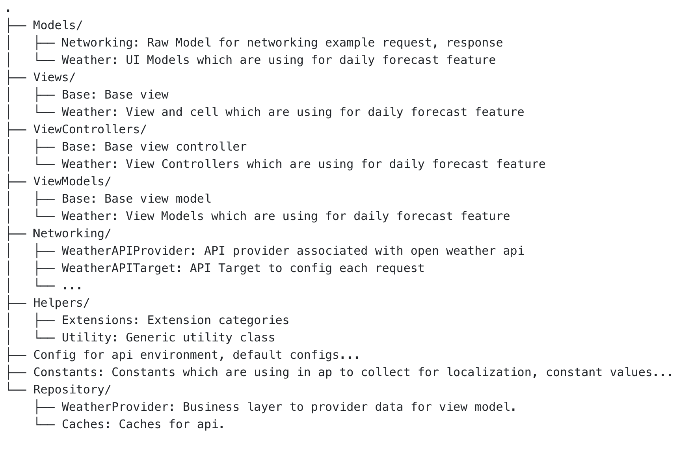

# NAB Coding Challange
## I. Setup

Open Terminal, move to project source code directory and run command

`pod install`

## Dependencies

* Moya: Most popular swift Network Abstraction Library. It provides us with an abstraction to make network calls without directly communicating with Alamofire. Also it supports stub and mock, very useful to write tests.
* RxSwift: Reactive Programming in Swift

## Requirements

* iOS 9.0+ / Mac OS X 10.9+
* Xcode 11.0+

## Overviews
 About architecture:
+ MVVM: I chose Model-View-ViewModel with Rxswift for binding.
+ Design Patterns: 
  + Observer
  + Dependency Injection
  + Decorator
+ Best practices: 
  + Always write test after finish one class. The code coverage is ~95%
  + Acception test: Automation test covers almost cases.
  + Caching mechanism: Weather information is changed regularly so Time-based caching is a best option to cache api response. I'm using Ram to cache the response by key (combine api path, search term and cnt) in certain time (1 hour by default, configable). The provider will get result from cache first if any before call network to avoid generating a bunch of API requests.
  + Apply SOLID to the project.

## Folder structure

##. Checklist:

1. [x] Programming language: Swift 
2. [x] Design app's architecture: MVVM
3. [x] UI should be looks like in attachment.
4. [x] Write UnitTests: Coverage 95%
5. [x] Acceptance Tests: Cover almost cases
6. [x] Exception handling
7. [x] Caching handling
8. [x] Accessibility for Disability Supports:
9. [x] Entity relationship diagram for the database and solution diagrams for the components, infrastructure design if any
10. [x] Readme file includes:

  

